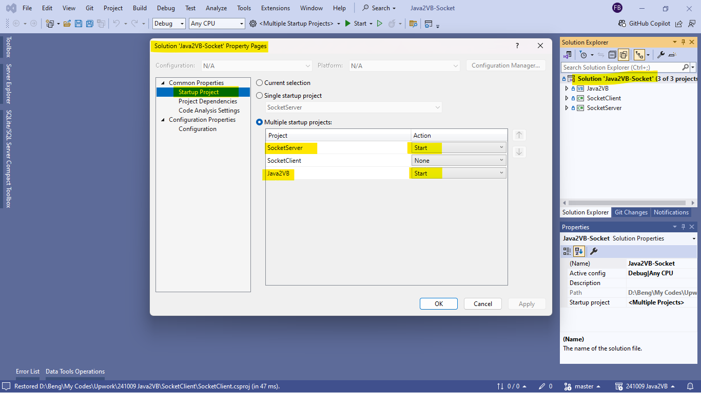

# 241009 Java2VB Socket Programming
convert the existing java socket program to VB.NET.

the solution consists of 3 projects:
1. Java2VB - the original java code and the VB.NET converted code.
2. ServerSocket - a simple server socket code for testing and debugging the socket operation.
3. ClientSocker - a simple client socket code for testing/debugging the socket operation and comparing to the Java2VB operation.

the solution is set to test/debug only 2 projects, ServerSocket (server) and Java2VB (client).

# Demo
the Youtube demo is here. [demo](https://youtu.be/m5slCPNo5Sw?si=wmceolwQk9jjEkDc)